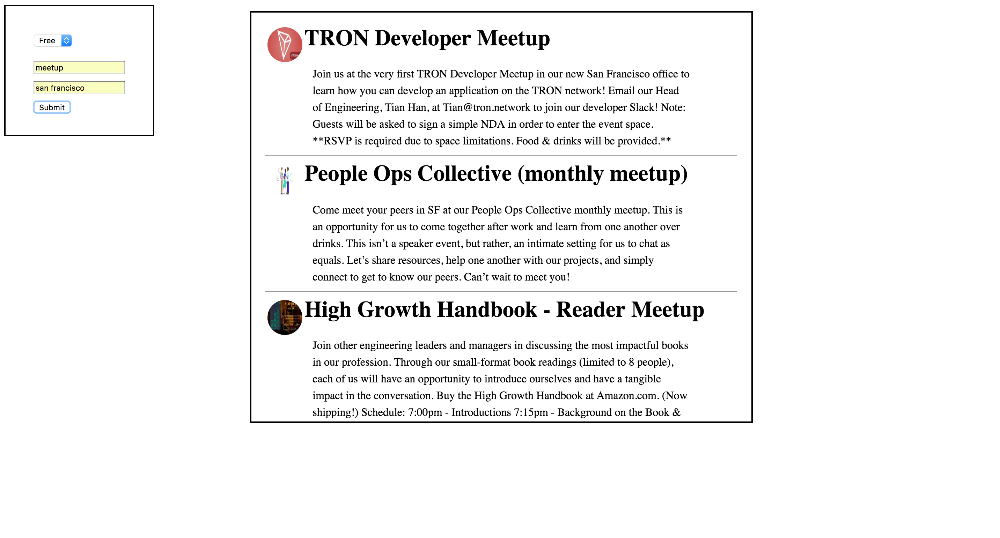

# Coding Drills

This repo contains a series of original coding drills designed to help people enhance their coding skills. 

These drills are also designed to accompany the curriculum of the [Trilogy Ed](https://www.trilogyed.com/) Full-Stack Coding Bootcamp.

## Getting Started

Each folder is named after the topic the exercises within cover. Each folder within a given topic contains its own unique exercise. 

Students are meant to use only the readme and prompt file for each exercise. Once they have finished, they should compare their results against those found in the solved folder.

Teachers using these exercises are encouraged to remove the solved folders from each exercise until their students have completed the prompts. 


## Examples

### Final Products

#### Mastering the Bootstrap grid


#### Mastering AJAX and API research


### Prompts

```
// ========================= QUESTION 1 =========================
// Without loonking back at the example given to you in the readme, do your best to recreate the same code using a ternary.
// Remember, if the argument is true "Yea, it's true" is logged to the console, and if it's false "Nah, it's false" is logged to the console. 

var bool = false;

function fun(arg) {

  //Your answer in the console.log()
  console.log();
}

fun(bool) 


// ==============================================================
```

### Installing

Feel free to clone down this repository!

Some exercices may contain installation instructions of their own. Refer to the exercise in question's readme for further instructions.

## Authors

* **Sasha Patsel** - *Initial work* - [Sasha Patsel](https://github.com/SashaPatsel)

## License

This project is licensed under the MIT License - see the [LICENSE.md](LICENSE.md) file for details

## Acknowledgments

* Jerome Chennette 
* Robert Shaw
* Ricky Feng

