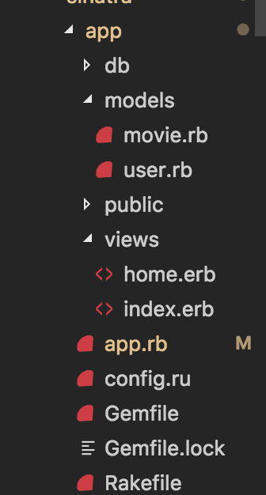

# Sinatra

## Fav-flix: A full-stack app built with Sinatra

### Introduction

Sinatra is a Ruby framework designed to easily create web applications. 

In terms of functionality, think of it as similar to Node with Express.

Check out some [applications build with Sinatra](http://sinatrarb.com/wild.html).

To learn the basics of Sinatra, we'll build a fairly simple application. In a nutshell, our application will allow a user to pick a username, search for movies, and then save his/her favorite movies (which will be associated specifically with that username).

This means we will cover:
- Configuring a Sinatra application
- Routing
- Connecting to a client
- ORM
- Database migration
- Data model associations

### Prerequisites
- MySQL
- Ruby 

### Instructions

1. Run `Gem install bundle` (it does not matter where this command is run).

2. Navigate to sinatra/unsolved/app

3. Run `bundle init`. This will create a `Gemfile` for you. Think of this as our package.json. It is where we will list our app's dependencies.

4. These are our app's dependencies:
```ruby

# DEPENDENCIES
# Lets us hit external API
gem 'rest-client'
# The backbone. With Sinatra, we can easily set up our routes. Think of it as express for Ruby
gem "sinatra"
# DB
gem "mysql2"
# ORM
gem 'sinatra-activerecord'
# Task-automater
gem 'rake'
# Get/set cookies
gem "sinatra-contrib"
# Sends responses as JSON
gem "json"

```
Copy the above code and paste it inside you gemfile. If you are curious about what you are adding to your app, please refer to the comments above each dependency.

5. From the root of your app, run `bundle install`. This will read our `Gemfile` and install all the dependencies we've listed within it. You shoulde see `Gemfile.lock` in your app's root once this command has run. 

6. At your app's root, create the files `app.rb` and `config.ru`

7. In `config.run`, write the following code. 

```ruby
require "./app"

run HiSinatra

```

This code will allow us to start our app by running `rackup` from our project's root.

8. Let's require all the packages we've installed for future use. In `app.rb`, write the following code: 
```ruby
# DEPENDENCIES
# Lets us hit external API
require 'rest-client'
require "sinatra/base"
require "sinatra/cookies"
require "json"
require "mysql2"
require 'sinatra/activerecord'
```

9. Let's test our app to see if we've set everything up correctly to this point. Let's instantiate the classs that will contain all of our routes.

```ruby
class HiSinatra < Sinatra::Base

end

```

What we're doing here is making a new class called HiSinatra (it does not need to be called that), and building it on top of Sinatra's Base class. Put more simply though, we're creating a class where we'll define our routes. 

Inside of the class we just created, we can define routes like so:

```ruby

get "/" do
    "Hello World"
end

```

If you write the above code within the class we defined in this step, and then run `rackup` from the command line, you should see a page with "hello world" written on it at localhost:9292. 

If you are able to see "hello world" on your browser at localhost:9292, you've done everything correctly up to this point.

10. Now let's build out our file structure:



Replicate the above file structure. This includes the following:

- Create a file `Rakefile`
- Create a folder `db`
- Create a folder `models`
    - Within models, create `movie.rb`
    - Within models, create `user.rb`
- Create a folder `views`
    - Within views, create `index.erb`
    - Within views, create `home.erb`
- The public folder is already provided for you. 

11. Now that our app's basic structure has been filled out. We can start to talk about rendering some views. This is extremely simple in Sinatra. First though, let's create some content to render.

In the last step, we created a file called `index.erb`. Fill it out with the following code: 

```html

<!DOCTYPE html>
<html>
<head>
    <title>FavFlix</title>
    <link rel="stylesheet" href="https://stackpath.bootstrapcdn.com/bootstrap/4.2.1/css/bootstrap.min.css" integrity="sha384-GJzZqFGwb1QTTN6wy59ffF1BuGJpLSa9DkKMp0DgiMDm4iYMj70gZWKYbI706tWS" crossorigin="anonymous">
    <link rel="stylesheet" type="text/css" href="/assets/css/style.css">
</head>
<body>
    <div class="index__parallax"></div>

    <div class="container">
        <div class="jumbotron mt-lg">
            <h1 class="display-4">HELLO!</h1>
            <p class="lead">Please enter your username if you've already made an account with us.</p>
            <p class="lead">If you haven't made a username yet, go ahead and enter one below to get started.</p>
            <hr class="my-4">
            <form id="signUpForm">
                <input id="username" type="text" name="username">
                <input id="signUpButton" type="submit" value="submit">
            </form>
        </div>
    </div>
    

    <!-- CDNs-->
    <script src="https://code.jquery.com/jquery-3.3.1.slim.min.js" integrity="sha384-q8i/X+965DzO0rT7abK41JStQIAqVgRVzpbzo5smXKp4YfRvH+8abtTE1Pi6jizo" crossorigin="anonymous"></script>
    <script src="https://cdnjs.cloudflare.com/ajax/libs/popper.js/1.14.6/umd/popper.min.js" integrity="sha384-wHAiFfRlMFy6i5SRaxvfOCifBUQy1xHdJ/yoi7FRNXMRBu5WHdZYu1hA6ZOblgut" crossorigin="anonymous"></script>
    <script src="https://stackpath.bootstrapcdn.com/bootstrap/4.2.1/js/bootstrap.min.js" integrity="sha384-B0UglyR+jN6CkvvICOB2joaf5I4l3gm9GU6Hc1og6Ls7i6U/mkkaduKaBhlAXv9k" crossorigin="anonymous"></script>
    <script src="https://cdnjs.cloudflare.com/ajax/libs/jquery/3.2.1/jquery.min.js"></script>
    <script src="assets/javascript/index.js"></script>
</body>
</html>

```

If you look at the code above, you may notice that both the link tag refering to our local stylesheet, and the script tag refering to our local javascript file. Do not have the proper relative path from this erb file. That is because sinatra is serving up our public folder as static assets. What this means for us is that we can refer to things inside the `public` folder (it _must_ be called `public`, sinatra is looking specifically for a folder with this name), we can act as though we are already inside the public folder. Therefore, our relative path begins at `assets`.

12. Once you've pasted the above code, go back to `app.rb`. The last time we were in this file, we wrote "hello world" to the root route of our app. Now, we'll actually serve up a view.

The code looks like this:

```ruby

 get "/" do
        # We can simply refer to our HTML (stored in this app as .erb files) with the following syntax.
        erb :index
    end     

```

Run `rackup` again from your project's root. Open localhost:9292 in your browesr. If you see a background image and a form, you're all set to this point. 

13. Now that we've learned how to render a basic view, let's talk about our database. First off, configure your code to connect with your MySQL database.
Write the code below in `app.rb` towards the top of the file. 

```ruby
ActiveRecord::Base.establish_connection adapter: 'mysql2', database: 'sinatra_db', host: 'localhost', username: 'root', password: 'password' 

```

Change out the above code so that it matches with your own device's settings. 

Active record is an ORM (Object Relational Model) that we can use with Sinatra. With the above code, we are configuring it to communciate with our MySQL server. In other words, all database queries we make will be made with MySQL. 

14. 