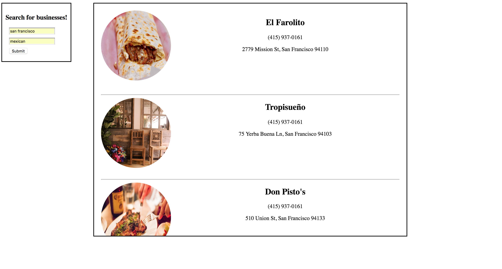

# So you think you can API? Pt.4

## Learn to use brand new APIs!

### Step 1
Get your API key.

Visit [this link](https://www.yelp.com/login?return_url=%2Fdevelopers%2Fv3%2Fmanage_app) to get your API key from Yelp.

You will first be prompted to sign in or up. Do so.

Once you've signed in, hit the `create app` tab on the left side of your screen.

As per usual, fill out all the fields. The information you enter here is not that important. It just matters that you submit the form and get your keys.

### Step 2
Read the docs.

Under Yelp Fusion on the left hand side of your screen, you'll see a tab called `Business Endpoints`. Click on it.

Beging to understand how to query the Yelp API for businesses in a given location. 

[Here is the direct link to the docs](https://www.yelp.com/developers/documentation/v3/get_started)

The authorization is a little trickier here. We will have to send it along as a header.

If this seems confusing, study [this example](https://github.com/Yelp/yelp-fusion/issues/221). The code snippet at the beginning of the post contains a proper way of sending our credentials to the Yelp API.

### Step 3
You are already given an event listener for the .yelp form submit in prompt.html. Within that event listener, grab a hold of the values the users input (the location and category)

Console.log() the values and see if they match what you entered into the form.

### Step 4
Make an AJAX call to the Yelp API based on your research. Try and get a response back that returns a series of business fitting within a specified location and category.

Before you use the user input values, it will be faster to make a successful API using hard-coded values (i.e. no variables). It will also be helpful to keep this Ajax call outside of any click/submit events while we test it.

Once you've console.log()ed a successful response, you're ready for the next step.

### Step 5 
Now that yopu've made a successful API call, replace your hard-coded values with values input by the user. 

You're ready to move to the next step once the response changes depending on the user input.

### Step 6

