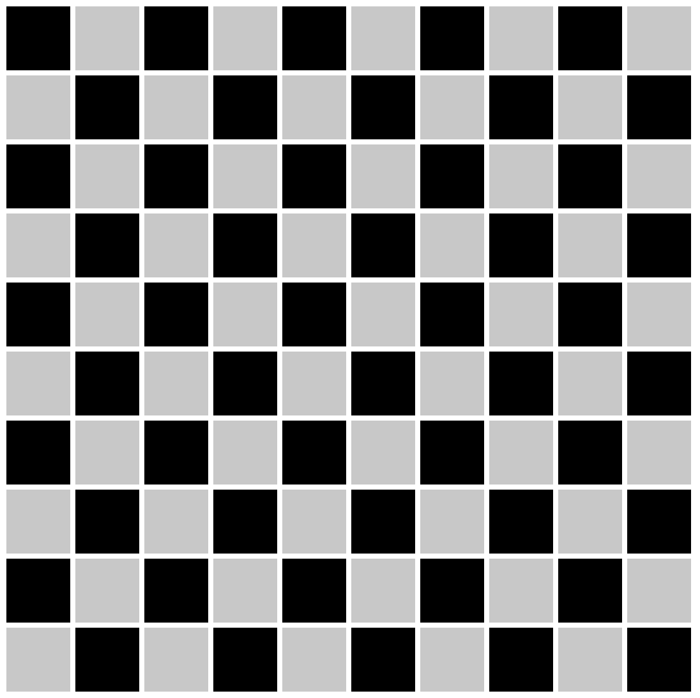

# Algos

## The King's Board

## Instructions
In Chess, the king piece can only move one square at a time.

Imagine you're given a number, let's call it n. After n moves in how many possible squares can the king be.

`In how many possible squares can the king find himself in after n moves? Write down a formula that gives this answer`

#### It is always helpful to visualize problems like this before you try to tackle them

You can also run the file in prompt.html to see the board on your browser, or add more pieces to the board if that helps you visualize the problem.